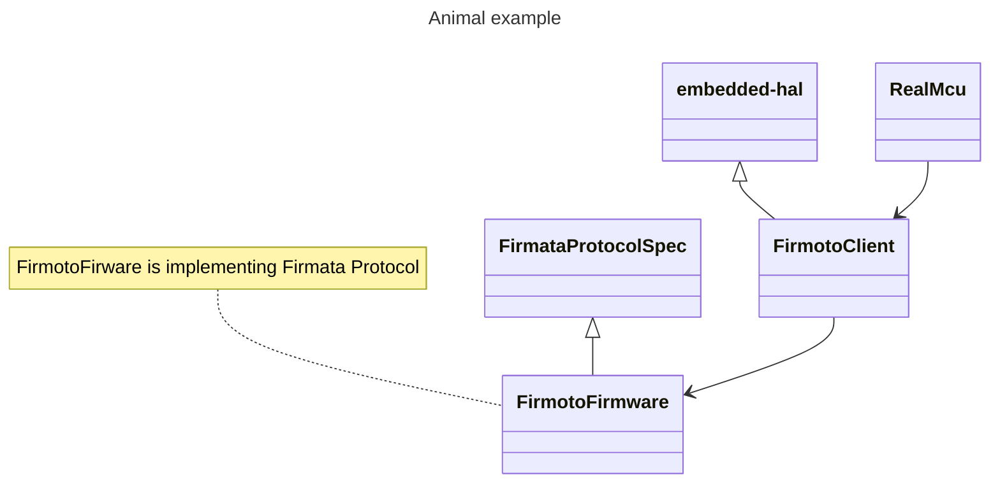

# 🦫 Introduction 

Firmoto attempt port [Firmata protocol](https://github.com/firmata/protocol/tree/master) in rust that compliance with [embeded-hal](https://github.com/rust-embedded/embedded-hal), so we can easily to use any microcontroller that able to run embeded-hal. 

with that we can easily make prototype firmware in high level pc, then run that on production on real MCU device. 



```shell

Firmoto Client(Rust) --talk to--> Firmoto Firmware 
Firmoto Client(Rust) is implementing embeded-hal

Copy Firmoto Client To Real MCU 

```


## Important Note 

- `probe-rs chip list`
- `qemu-system-arm --machine help | rg -i m4`

## Reference 

- protocol bpio2, https://docs.buspirate.com/docs/binmode-reference/protocol-bpio2 
- esp32 buspirate, https://github.com/geo-tp/ESP32-Bus-Pirate/blob/main/src/Controllers/SpiController.cpp
- running cortex-arm in qemu, https://docs.rust-embedded.org/book/start/qemu.html 
- knurling-rs app template, https://github.com/knurling-rs/app-template
